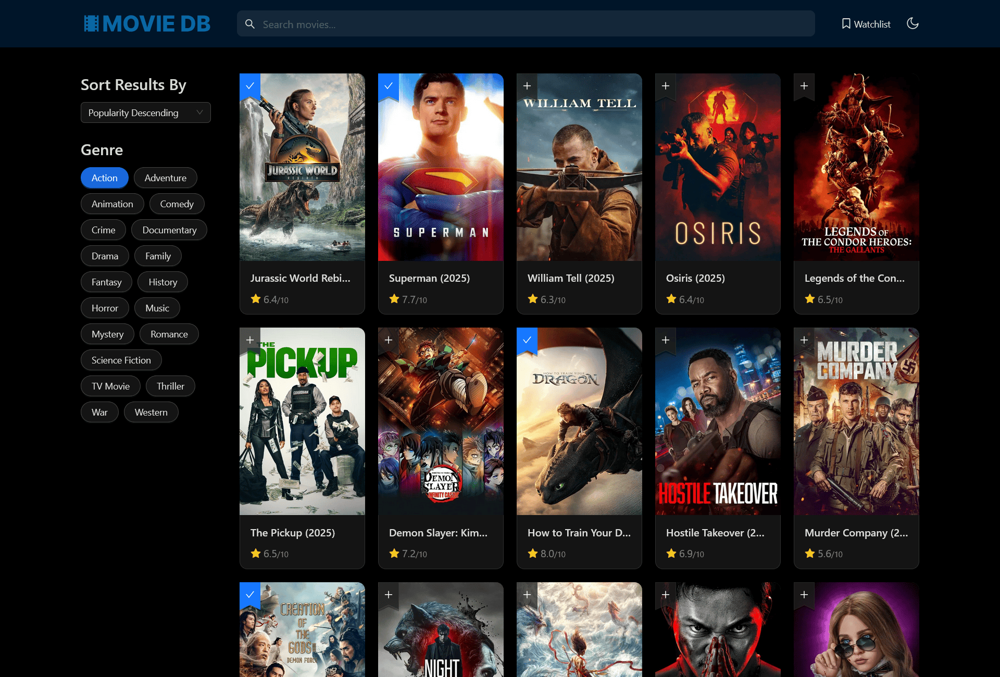

# 🎬 Movie Discovery App

A **React-based web application** that helps users explore and discover new movies tailored to their interests. Leveraging the [TMDB](https://www.themoviedb.org) API, the app features search, filter, and sorting capabilities to browse a vast movie database, along with the ability to add movies to a personalized watchlist.

Check out the live demo of the app at [https://moviedb-ecru.vercel.app](https://moviedb-ecru.vercel.app)

## 🛠️ Tech Stack

- **React** – Frontend framework
- **Ant Design** – UI components and styling
- **React Router** – Client-side navigation
- **Zustand** – Lightweight state management
- **Vite** – Development build tool
- **TMDB API** – Movie data source

## 🚀 Installation & Setup

Follow these steps to run the project locally:

1. [Clone the repository](https://docs.github.com/en/repositories/creating-and-managing-repositories/cloning-a-repository) to your local machine.
2. Navigate to the project directory and install the dependencies by running `npm install`.
3. Go to [themoviedb.org](https://www.themoviedb.org), register for a free account, and obtain your API key.
4. Create a `.env` file in the project's root directory and store your API access token in the VITE_ACCESS_TOKEN environment variable: `VITE_ACCESS_TOKEN="your_api_access_token_should_be_here"`.
5. Start the development server by running `npm run dev`.